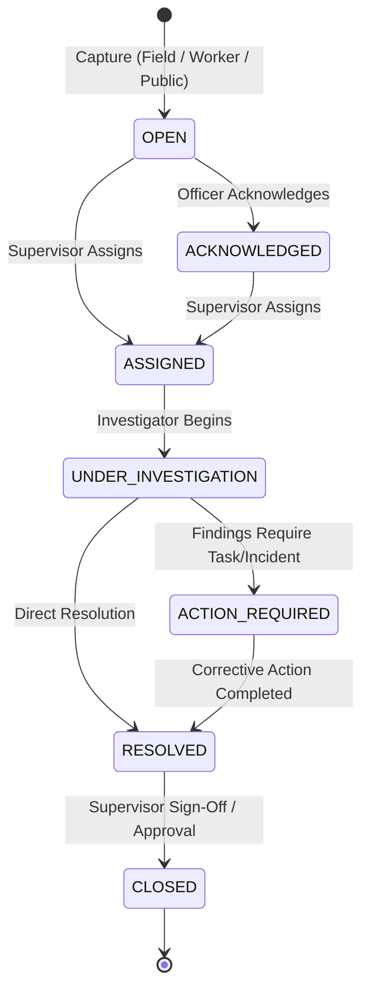

# MOBILE-14 — Grievance & Public/Worker Issue Field Operations
## TRINETRA Smart Governance & Compliance Monitoring System for Coal Mines

---

## 1. Executive Summary & Objective

**MOBILE-14** delivers end-to-end Grievance and Public/Worker Issue Field Operations for the TRINETRA mobile platform. It satisfies Problem Statement requirements for comprehensive, transparent, and auditable grievance handling in active mining leases.

Rather than implementing a standalone ticketing silo, MOBILE-14 directly reuses and extends the canonical TRINETRA governance, inspection, evidence, GIS, offline synchronization, SLA, notification, review/approval, and SHA-256 audit infrastructure.

### Operational Lifecycle
```
GRIEVANCE / WORKER ISSUE
          ↓
CAPTURE (GPS Context + SHA-256 Evidence)
          ↓
CLASSIFY & CATEGORIZE
          ↓
ACKNOWLEDGE (Formal Intake Timestamp & Audit)
          ↓
ASSIGN (Mine-Scoped Officer & Priority)
          ↓
INVESTIGATE (Field Findings & Observations)
          ↓
CORRECTIVE ACTION / TASK GENERATION (Optional Downstream Link)
          ↓
SLA TRACKING (Authoritative Server Deadline & Status)
          ↓
RESOLUTION SUBMISSION (Field Remediation Report)
          ↓
SUPERVISOR REVIEW & DIGITAL SIGN-OFF (Separation of Duties)
          ↓
IMMUTABLE AUDIT TRAIL (SHA-256 Hash Chain)
```

---

## 2. Architecture & Reused Canonical Models

MOBILE-14 preserves complete architectural alignment by extending canonical models and reusing existing core subsystems:

| Domain Subsystem | Existing Model / Service Reused | Extension / Role in MOBILE-14 |
| :--- | :--- | :--- |
| **Grievance** | `app.models.grievance.Grievance` | Extended with GPS coordinates, location source, evidence metadata, investigation findings, downstream task/incident linkages, acknowledgment, and lifecycle timestamps. |
| **Field Service** | `app.services.field_service.FieldService` | Added `get_mobile_grievance_summary`, `get_mobile_grievances`, `get_mobile_grievance_detail`, `create_mobile_grievance`, `acknowledge_mobile_grievance`, `assign_mobile_grievance`, `investigate_mobile_grievance`, `resolve_mobile_grievance`. |
| **Sync Batch** | `FieldService.process_sync_batch` | Enhanced `GRIEVANCE` entity processing with idempotent `CREATE`, `INVESTIGATE`, and `RESOLVE` batch transactions. |
| **Governance Task** | `app.models.governance.GovernanceTask` | Reused for downstream field task creation when investigation identifies actionable corrective measures. |
| **Incident** | `app.models.incident.Incident` | Reused for safety incident linkage when unsafe conditions or hazards are uncovered. |
| **Approvals** | `app.models.governance.ApprovalRequest` | Reused for formal digital sign-off on grievance resolutions requiring supervisor sign-off. |
| **Notifications** | `app.models.notification.Notification` | Reused for mine-scoped, role-targeted, deep-linked notifications (`GRIEVANCE_CREATED`, `GRIEVANCE_ASSIGNED`, `GRIEVANCE_RESOLVED`). |
| **Audit Ledger** | `app.models.audit.AuditEvent`, `AuditService` | Reused for tamper-evident SHA-256 chained audit logs across every state transition. |
| **GIS & Location** | `MOBILE-04` Spatial Infrastructure | Captures device GPS or surveyed mine zone coordinates with explicit data provenance. |
| **Evidence** | `MOBILE-03` Evidence Capture | Local photo/file capture with client-side SHA-256 fingerprinting, MIME validation, and tamper-resistant storage. |

---

## 3. API Endpoints

All endpoints are strictly authenticated (`JWT Bearer`), role-guarded via RBAC, and strictly isolated by `mine_id`.

```http
GET  /api/v1/mobile/grievances/summary
GET  /api/v1/mobile/grievances?status=&priority=&category=&assigned_to_me=&search=
GET  /api/v1/mobile/grievances/{grievance_id}
POST /api/v1/mobile/grievances
POST /api/v1/mobile/grievances/{grievance_id}/acknowledge
POST /api/v1/mobile/grievances/{grievance_id}/assign
POST /api/v1/mobile/grievances/{grievance_id}/investigate
POST /api/v1/mobile/grievances/{grievance_id}/resolve
```

---

## 4. State Machine & Transitions

The lifecycle adheres to authoritative backend state machine rules:



### Transition Enforcement
- `OPEN` / `ACKNOWLEDGED` $\to$ `ASSIGNED` requires valid `assigned_to_id` within the same mine.
- `ASSIGNED` / `UNDER_INVESTIGATION` $\to$ `RESOLVED` requires factual `resolution_summary` and `action_taken`.
- Invalid state transitions (e.g. attempting to resolve an `OPEN` unassigned grievance) are rejected with `HTTP 400 Bad Request`.

---

## 5. Privacy, Data Minimization & Security

1. **Role-Based Visibility**: Complainant contact details are masked in mobile list views. Full details are only accessible to authorized investigators and mine managers.
2. **Mine Isolation**: Users belonging to a specific mine cannot query, assign, investigate, or resolve grievances belonging to other mines.
3. **No Sensitive PII**: No Aadhaar numbers, banking details, or biometric credentials are collected or stored.
4. **Separation of Duties (SoD)**: An investigator submitting a resolution cannot digitally sign off on their own resolution if supervisor approval is mandated.

---

## 6. Offline Resilience & Sync Engine

MOBILE-14 utilizes the canonical `trinetra_field_sync_queue` and `FieldService.process_sync_batch`:

1. **Capture Offline**: Grievances logged without network connectivity are stored in IndexedDB/Local queue with `client_id` (UUID v4) and status `PENDING SYNC`.
2. **Network Restoration**: The Sync Engine batches mutations and invokes `POST /api/v1/mobile/sync/batch`.
3. **Idempotency**: The server verifies the `client_id` against previous sync records to guarantee zero duplicate creations even under intermittent retries.
4. **Conflict Resolution**: If a record was modified concurrently on the server, the backend flags `CONFLICT` and prevents destructive overwrites.

---

## 7. Multilingual Support

The mobile user interface is fully localized across 3 languages:
- **English (`en`)**
- **Hindi (`hi`)** — हिन्दी
- **Telugu (`te`)** — తెలుగు

All labels, status indicators, priorities, form placeholders, category tags, modal headers, action buttons, and confirmation notices use centralized i18n keys without hardcoded fallback strings.

---

## 8. Claims & Factual Discipline

- **No Premature Judgment**: The system records "Investigation finding recorded" and "Grievance acknowledged for processing" rather than asserting "Complaint proven" or "Complaint false".
- **Evidence Provenance**: SHA-256 fingerprints attest to cryptographic file integrity post-capture; they do not autonomously verify historical authenticity before device capture.
- **Location Context**: GPS coordinates represent the contextual location of record creation or surveyed mine zone; they do not claim to verify subterranean worker presence.

---

## 9. Verification & Test Suite

- **Focused Test Suite**: `backend/tests/test_mobile_grievance_field.py` (7/7 tests passed 100%).
- **Backend Full Regression**: Full test suite across all subsystems (`pytest tests/`).
- **Frontend Typecheck & Production Build**: `npm run build` (`tsc -b && vite build`) passed with zero errors.
