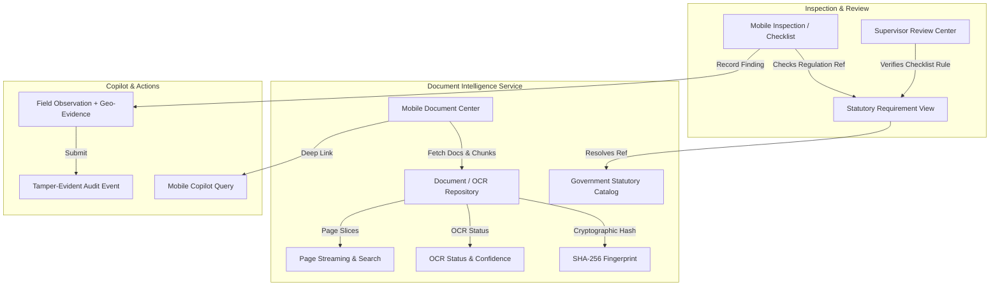

# TRINETRA MOBILE-10: Field Documents & Statutory Records Architecture

## 1. Overview & Objective
The Field Documents & Statutory Records subsystem (`MOBILE-10`) bridges operational field activities with authoritative statutory governance material in TRINETRA. Field officers, safety inspectors, and reviewing supervisors can immediately inspect the statutory requirement, regulation excerpt, and source document at the point of inspection and review.

The end-to-end governance lifecycle is preserved:
$$\text{TASK} \to \text{INSPECTION} \to \text{STATUTORY REQUIREMENT} \to \text{SOURCE DOCUMENT} \to \text{REFERENCE / CHECK} \to \text{OBSERVATION} \to \text{EVIDENCE} \to \text{REVIEW} \to \text{AUDIT}$$

---

## 2. Architectural Principles & Zero-Duplication Policy
1. **Reuse Existing Models**: Reuses canonical Phase 12A document ingestion (`Document`, `DocumentPage`, `ExtractedDocumentField`) and Phase 11C Government RAG catalog (`GovernmentDocument`, `DocumentChunk`, `DOCUMENT_CATALOG`).
2. **Zero Second OCR Engine**: Relies strictly on the unified `DocumentIntelligenceService` OCR and structured field extraction pipeline.
3. **Zero Fabricated Legal Standards**: Statutory requirements are loaded verbatim from official gazettes and regulations (e.g., Coal Mines Regulations 2017, Mines Creche Rules 1966, Environment Protection Act 1986).
4. **Source Provenance & Tamper-Evidence**: Every record carries SHA-256 cryptographic fingerprints, source document titles, publisher authorities (e.g. DGMS, MoEFCC), and exact page citations.

---

## 3. Data Flow & Provenance Model

---

## 4. Key Components

### 4.1. Mobile Backend Endpoints (`/api/v1/mobile`)
- `GET /api/v1/mobile/documents`: Unified document feed filtered by category (`ALL`, `DGMS`, `MINE_SAFETY`, `ENVIRONMENT`, `COMPLIANCE`, `INSPECTION`, `CIRCULAR`, `SOURCE_DATA`), search query, and mine scope.
- `GET /api/v1/mobile/documents/{doc_id}`: Full document detail including page streaming, extracted key-value fields, OCR confidence, and SHA-256 integrity hash.
- `GET /api/v1/mobile/documents/requirement/{regulation_ref}`: Direct statutory lookup resolving regulation citations (e.g., `CMR-2017-REG-106`) to official titles, source acts, page citations, and verbatim rule texts.

### 4.2. Mobile Document Center (`MobileDocumentsScreen.tsx`)
- **Metric Summary Cards**: Displays total indexed documents, verified OCR records, statutory rules, and offline cached files.
- **Search & Category Pills**: Real-time filtering across regulation references, titles, mine scopes, and document types.
- **Document Cards**: Visual indicators for Tier 1 (Official Gazette) and Tier 3 (Mine Operational) documents, OCR status (`VERIFIED`, `REQUIRES_REVIEW`, `UNAVAILABLE`), and quick SHA-256 copying.
- **Document Viewer Modal**: Fast page stream pagination (`Page X of Y`), text search, extracted field table, and offline readiness tags.
- **Statutory Requirement Modal**: Displays authoritative legal excerpts, applicable scopes, and deep links to source documents.

### 4.3. Offline Resilience & Sync
- Readily cached documents are marked `AVAILABLE OFFLINE` with sync timestamps.
- Uncached or non-offline records are flagged with `SYNC NEEDED / NOT CACHED`.
- Stale or expired records show `STALE SOURCE - REFRESH RECOMMENDED` to prevent reliance on outdated local files.

---

## 5. Security & Mine Isolation
- **RBAC Enforcement**: Internal mine plans and sensitive inspection records are filtered strictly by `mine_id` matching the authenticated JWT token.
- **Public & Gazette Scope**: National statutory acts and DGMS circulars (marked `mine_id=None` or `PUBLIC`) are securely accessible across mines.
- **Regulator Access**: Regulators have read access to published circulars and authorized inspection documents without leaking sensitive proprietary mine files.

---

## 6. Claims & Governance Discipline
- **Reference Material Only**: A source document is reference evidence, not automatic proof of operational compliance.
- **Human Review Required**: OCR and AI extractions remain in `DRAFT` / `REQUIRES_REVIEW` state until confirmed by certified safety officers.
- **No Legal Representation**: TRINETRA presents source texts verbatim; it does not claim to replace certified legal counsel or government inspectors.
