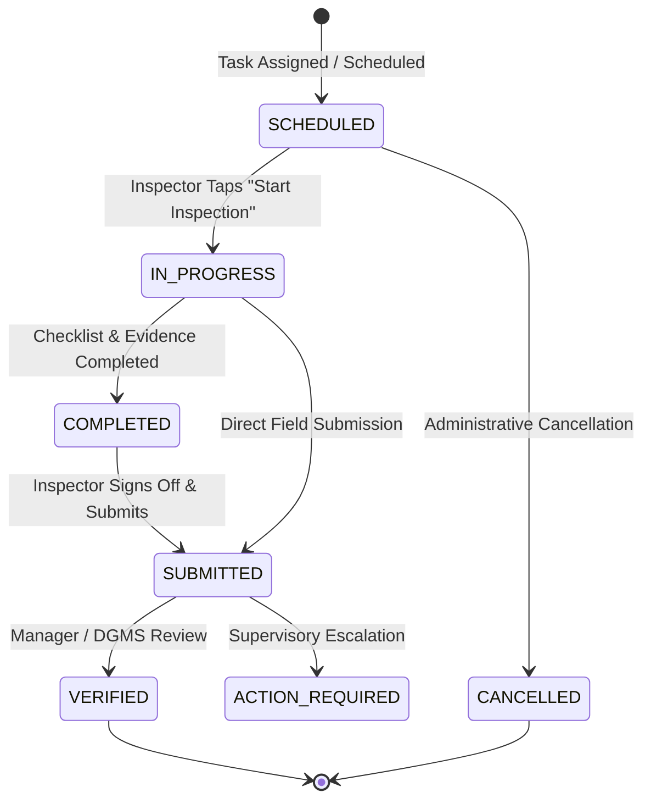

# TRINETRA MOBILE-02: Field Task & Inspection Execution Architecture

## 1. Overview
MOBILE-02 implements the end-to-end field task and statutory inspection execution workflow for the TRINETRA Smart Mine Governance AI platform:
$$\text{Assigned Task} \longrightarrow \text{Task Details / Risk Context} \longrightarrow \text{Start Inspection} \longrightarrow \text{Interactive Checklist} \longrightarrow \text{Observation} \longrightarrow \text{Evidence Capture} \longrightarrow \text{Location / Timestamp} \longrightarrow \text{Review} \longrightarrow \text{Submit} \longrightarrow \text{Sync / Cryptographic Audit}$$

The architecture provides complete field utility for mining safety inspectors, supervisors, and DGMS auditors while maintaining strict data isolation, RBAC enforcement, and truthful labeling of browser/device hardware capabilities.

---

## 2. Reused Operational Models & Services

### Reused Backend Models
- `FieldInspection`: Authoritative inspection entity storing `inspection_code`, `mine_id`, `level_id`, `zone_id`, `inspector_id`, `status`, `checklist_json`, `summary_notes`, `severity_assessment`, `started_at`, `completed_at`, `latitude`, `longitude`, `gps_accuracy_meters`.
- `FieldEvidence`: Geo-tagged evidence metadata storing `evidence_code`, `mine_id`, `inspection_id`, `evidence_type`, `title`, `description`, `file_hash_sha256`, `file_size_bytes`, `latitude`, `longitude`, `client_capture_timestamp`, `server_received_timestamp`.
- `FieldSyncLog`: Offline idempotent transaction logs preserving `operation_id`, `mine_id`, `user_id`, `entity_type`, `entity_id`, `operation_type`, `client_timestamp`, `status`.
- `AuditEvent`: Append-only cryptographic audit trail recording actor, action (`FIELD_INSPECTION_CREATED`, `FIELD_INSPECTION_UPDATED`, `FIELD_EVIDENCE_RECORDED`), before/after state diffs, and SHA-256 integrity hashes.
- `Mine`, `MineLevel`, `MineZone`, `User`, `UserMineAssignment`.

### Reused Backend Services & Endpoints
- `FieldService`:
  - `get_inspector_inspections`: Returns mine-scoped tasks enriched with predictive risk scores.
  - `get_single_inspection`: Retrieves inspection details, checklist, risk attributions, and attached evidence.
  - `create_inspection`: Inserts new field inspection and creates audit log.
  - `update_inspection`: Enforces valid state transitions (`SCHEDULED` $\to$ `IN_PROGRESS` $\to$ `COMPLETED` $\to$ `SUBMITTED` $\to$ `VERIFIED`), persists checklist JSON, and updates timestamps.
  - `save_evidence`: Stores SHA-256 hashed evidence metadata and writes audit record.
  - `process_sync_batch`: Fault-tolerant, idempotent batch synchronization for offline operations.
- `PredictiveRiskService`: Delivers real-time 30-minute horizon risk forecasts and contributing signal attributions (methane drift, ventilation deviation, sensor anomalies).

---

## 3. Inspection State Machine

### State Transition Validation Rules
- `SCHEDULED` $\to$ `IN_PROGRESS` (sets authoritative `started_at` timestamp).
- `IN_PROGRESS` $\to$ `COMPLETED` / `SUBMITTED` (sets authoritative `completed_at` timestamp).
- Illegal jumps (e.g., `SCHEDULED` $\to$ `VERIFIED`) are strictly rejected by the backend state machine with HTTP 422 (`BusinessRuleViolationError`).

---

## 4. Checklist & Observation Architecture

1. **Configurable DGMS Checklist Schema**:
   - Structured checklist items with `id`, `category` (`ATMOSPHERE`, `VENTILATION`, `STRATA`, `MACHINERY`, `PPE`, `SAFETY`, `EMERGENCY`), `item_text`, `status` (`COMPLIANT`, `OBSERVATION`, `NON_COMPLIANT`, `NOT_APPLICABLE`), `notes`, `severity` (`LOW`, `MEDIUM`, `HIGH`, `CRITICAL`), and `regulatory_reference` (e.g., *CMR 2017 Reg 153*).
2. **Observation Governance Principle**:
   - Field observations do **not** automatically establish statutory violations without supervisory review.
   - Non-compliant items prompt the inspector for severity assessment, descriptive notes, and statutory references.

---

## 5. Truthful Evidence & Location Handling

1. **Browser Camera / File Capture**:
   - Utilizes standard HTML5 `<input type="file" accept="image/*" capture="environment">`.
   - Explicitly labeled in the UI as **Browser Camera / File** (never mislabeled as native Android camera).
   - Computes live client-side cryptographic SHA-256 hash using `crypto.subtle.digest('SHA-256', arrayBuffer)` prior to transmission or offline queueing.
2. **Location Acquisition**:
   - Queries `navigator.geolocation.getCurrentPosition` with high accuracy and WGS84 datum.
   - When actual GPS fix is achieved, labeled as **Actual GPS Fixed (±X meters)**.
   - If GPS is unavailable or underground, falls back to surveyed mine coordinates with explicit label: **Surveyed Mine Coordinates**.

---

## 6. Offline-First Resilience & Idempotency

1. **Local Draft Persistence**:
   - Active inspection state, checklist responses, and evidence references persist to `localStorage` key `trinetra_field_draft_insp_{id}` continuously.
2. **Offline Submission Queue**:
   - If network connectivity is lost, submission packages the operation with a client-generated UUID into `trinetra_field_sync_queue`.
   - UI displays truthful confirmation: `SAVED OFFLINE` (never claiming "Submitted" until acknowledged by server).
3. **Idempotency**:
   - Sync batch processor checks `FieldSyncLog.operation_id`. If already processed, returns `ALREADY_PROCESSED` without creating duplicate records.

---

## 7. Role-Based Access Control & Mine Isolation

- Strict verification: `User` $\to$ `UserMineAssignment` $\to$ `Mine` $\to$ `Permission`.
- Cross-mine queries return HTTP 403 / 404.
- Roles distinguished:
  - `FIELD_INSPECTOR`: Assigned task execution, checklist completion, observation logging, evidence attachment, submission.
  - `MINE_SAFETY_OFFICER` / `MINE_MANAGER`: Task assignment, supervisory review, verification sign-offs.
  - `REGULATOR`: Statutory oversight and compliance auditing.

---

## 8. Multilingual Support
Full UI support across English (`en`), Hindi (`hi`), and Telugu (`te`) for all inspection workflows, checklists, status badges, and validation alerts. Technical codes (e.g. `CMR 2017`, `INS-2026-BDS04-001`, SHA-256 hex strings) remain standard.
