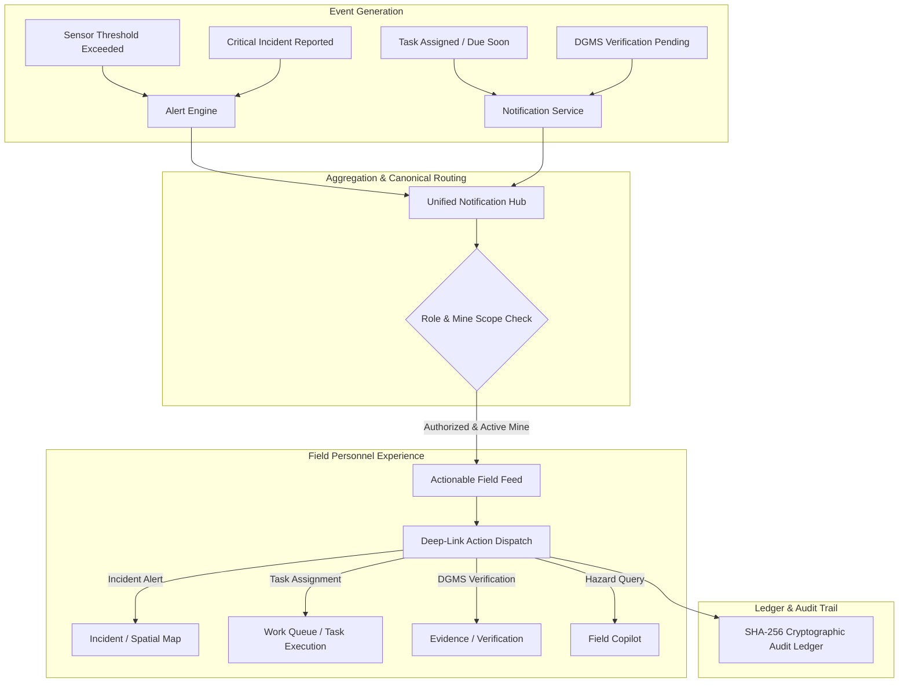

# TRINETRA Mobile Architecture: Field Communications & Actionable Notifications (MOBILE-07)

## 1. Overview & System Purpose

The **TRINETRA Mobile Actionable Notifications & Field Communications Engine** connects edge operational events directly with field personnel, engineers, shift supervisors, and DGMS inspectors:

$$\text{EVENT} \longrightarrow \text{NOTIFICATION} \longrightarrow \text{CONTEXT} \longrightarrow \text{ACTION} \longrightarrow \text{FIELD WORK} \longrightarrow \text{SYNC} \longrightarrow \text{VERIFICATION} \longrightarrow \text{AUDIT}$$

Instead of passive, un-actionable popups, TRINETRA notifications are tightly coupled with the canonical mine governance models (`Notification`, `Alert`, `Incident`, `GovernanceTask`, `SensorReading`, `RiskScore`, `FieldInspection`, and `AuditEvent`).

---

## 2. Notification Flow & Role-Scoped Visibility



---

## 3. Data Model & Unified Response Format

The mobile notification feed unifies two authoritative tables without modifying database schemas:
1. `notifications` — Targeted, user-specific notifications (Tasks, Approvals, System advisories).
2. `alerts` — Mine-wide operational and sensor alerts (Gas anomalies, Roof fall warnings, Ventilation failures).

### Unified DTO (`OperationalNotification`)
```json
{
  "id": "alert-42",
  "source_type": "ALERT",
  "title": "CH4 Gas Spike Detected in Zone B-East",
  "message": "Concentration exceeded 1.25% threshold at Sensor S-104",
  "severity": "CRITICAL",
  "category": "GAS_ANOMALY",
  "is_read": false,
  "created_at": "2026-09-21T16:30:00Z",
  "mine_id": 1,
  "mine_name": "Jharia Underground Block-3",
  "is_stale": false,
  "stale_reason": null,
  "deep_link": {
    "target_tab": "incidents",
    "resource_type": "incident",
    "resource_id": "8",
    "action_label": "OPEN INCIDENT",
    "action_params": {
      "focus": "map",
      "zone_id": 2
    }
  }
}
```

---

## 4. Deep-Link Action Matrix

| Notification Category | Target Tab | Action Dispatched | Description |
|:---|:---|:---|:---|
| **Incident / Safety Emergency** | `incidents` / `map` | `[ OPEN INCIDENT ]` | Navigates directly to incident details or spatial 2.5D map focus. |
| **Field Task Assignment** | `tasks` | `[ OPEN TASK ]` | Switches to Work Queue, selects task, and unlocks inspection flow. |
| **DGMS Compliance / Verification** | `inspections` / `tasks` | `[ REVIEW VERIFICATION ]` | Opens evidence review screen with cryptographic verification signatures. |
| **High Hazard / Slope Warning** | `map` | `[ VIEW RISK MAP ]` | Zooms GIS/2.5D map to the hazard coordinate and highlights level/zone. |
| **Advisory / Safety Regulation** | `copilot` | `[ ASK COPILOT ]` | Pre-fills AI Copilot with contextual prompt based on incident/task metadata. |

---

## 5. Security & Isolation Guarantee

- **JWT & Role Authentication**: Every notification query validates active JWT session and user roles.
- **Tenant Mine Isolation**: Only notifications matching the active authorized mine (or assigned user) are returned. Cross-mine leakage is strictly blocked (HTTP 403 / 404).
- **Graceful Stale Resource Resilience**: When an alert references a resolved or deleted incident/task, `is_stale` is computed dynamically. The UI displays an amber status badge and offers fallback navigation (`[ VIEW WORK QUEUE ]`) instead of failing.
- **Audit Verification**: Marking notifications as read writes immutable SHA-256 linked audit records (`NOTIFICATION_MARKED_READ` / `ALERT_MARKED_READ`).
