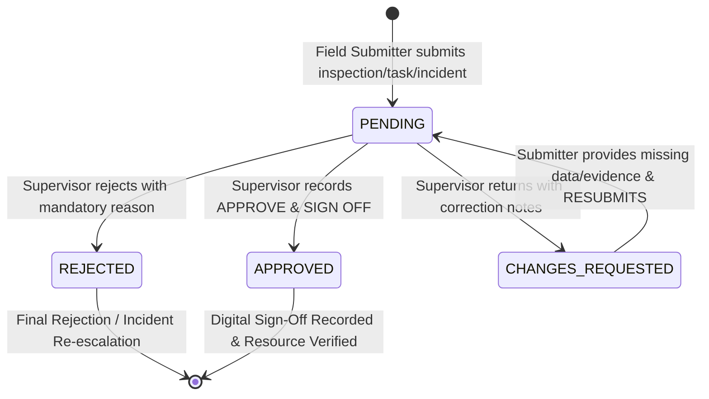

# TRINETRA MOBILE-09 — Supervisor Review, Governance Decision Engine & Digital Sign-Off

## 1. Executive Summary & Governance Loop
TRINETRA MOBILE-09 closes the field operational governance loop. While prior mobile phases focused on telemetry observation (MOBILE-01), field checklist execution (MOBILE-02), tamper-evident evidence capture with Web Crypto SHA-256 (MOBILE-03), spatial intelligence (MOBILE-04), hazard and incident response (MOBILE-05), task dispatch (MOBILE-06), push notifications (MOBILE-07), and offline sync (MOBILE-08), MOBILE-09 introduces **Supervisory Review, Separation of Duties (SoD) Enforcement, and Verifiable Digital Sign-Off**.

```
FIELD ACTION (Inspect / Remediate)
       ↓
TAMPER-EVIDENT EVIDENCE (Photos, SHA-256, GPS)
       ↓
SUPERVISOR REVIEW QUEUE (Pending, Urgent, Overdue)
       ↓
DECISION MATRIX:
   ├── APPROVE ──→ Digital Sign-Off Recorded ──→ Server Audit Trail Chained
   ├── REJECT ───→ Mandatory Reason Required ──→ Incident / Task Re-opened
   └── RETURN ───→ Mandatory Correction Notes ─→ Submitter Notified & Resubmitted
```

---

## 2. Reuse of Canonical Governance Infrastructure
In strict compliance with TRINETRA governance principles, **zero duplicate approval, audit, or notification systems** were introduced. MOBILE-09 directly interfaces with:

1. **`ApprovalRequest` Model** (`backend/app/models/approval.py`):
   - Canonical entity storing request code, resource type (`FIELD_INSPECTION`, `TASK`, `INCIDENT`, etc.), resource ID, mine ID, title, description, requester ID, required role, status (`PENDING`, `APPROVED`, `REJECTED`, `CHANGES_REQUESTED`), and timestamps.
2. **`ApprovalAction` Model** (`backend/app/models/approval.py`):
   - Canonical audit ledger storing discrete review events (`SUBMIT`, `APPROVE`, `REJECT`, `REQUEST_CHANGES`, `RESUBMIT`), actor ID, role utilized, comments/justification, and UTC timestamps.
3. **`AuditEvent` & `AuditService`** (`backend/app/models/audit.py`, `backend/app/services/audit_service.py`):
   - Chained audit events (`APPROVAL_DECISION_APPROVE`, `APPROVAL_DECISION_REJECT`, `APPROVAL_DECISION_REQUEST_CHANGES`, `APPROVAL_RESUBMITTED`, `DIGITAL_SIGNOFF_RECORDED`).
4. **`Notification` Model** (`backend/app/models/notification.py`):
   - Actionable push alerts dispatched to submitters and reviewers with deep-links to `/mobile/reviews`.

---

## 3. Role-Based Access Control (RBAC) & Separation of Duties (SoD)

### Role Permission Matrix
| Role | Queue Access | Can Approve / Sign-Off | Can Reject / Return | Can Resubmit |
| :--- | :---: | :---: | :---: | :---: |
| **`SYSTEM_ADMIN`** | All Mines | Yes (Global Override) | Yes | Yes (Admin Override) |
| **`MINE_MANAGER`** | Assigned Mines | Yes (If Not Submitter) | Yes | No |
| **`MINE_SAFETY_OFFICER`** | Assigned Mines | Yes (Statutory Items) | Yes | No |
| **`REGULATOR` (DGMS)** | Assigned Mines | Yes (Regulatory Scope) | Yes | No |
| **`FIELD_INSPECTOR`** | Assigned Mines | No (Submitter Only) | No | Yes (If Returned) |
| **`CONTRACTOR_MANAGER`** | Assigned Mines | No (Task Submitter) | No | Yes (If Returned) |

### Strict Separation of Duties (SoD)
- **Backend Invariant**: `req.requester_id == actor.id` strictly blocks approval (`HTTP 422 Unprocessable Content: Separation of Duties: You cannot approve your own submission`).
- **Frontend Safeguard**: Reviewers who submitted the item see a prominent Amber SoD lock banner explaining why approval is restricted, with approval actions disabled.

---

## 4. Lifecycle State Machine



---

## 5. Mobile Review Center UI Architecture
- **Unified Review Queue** (`frontend/src/mobile/screens/MobileReviewCenterScreen.tsx`):
  - Filter Tabs: `PENDING`, `URGENT` (>12h old), `OVERDUE` (>24h old), `RETURNED`, `APPROVED`, `REJECTED`, `ALL`.
  - Resource Filtering: All, Field Inspections, Governance Tasks, Incident Responses.
  - Search: Real-time fuzzy query across request codes, titles, submitter names, and mine names.
- **Review Detail Experience**:
  - **Header & SLA Badge**: Resource ID, Mine, Status Badge, Age / SLA countdown.
  - **Submitter Info Card**: Submitter profile, submission timestamp, required review role.
  - **Field Spatial Context**: Surveyed mine coordinates vs Actual GPS coordinates indicator with Leaflet GIS map integration.
  - **Checklist & Observations**: Full structured checklist breakdown with item compliance scores and observer notes.
  - **Evidence Gallery**: Interactive cards displaying photo previews, MIME types, file sizes, capture timestamps, and click-to-copy Web Crypto SHA-256 hashes.
  - **Audit Timeline**: Immutable chronological list of all submission, review, return, and resubmission events.
  - **Action Decision Tray**: Context-aware buttons (`Approve & Sign Off`, `Return for Correction`, `Reject`, `Resubmit Work`).

---

## 6. Offline Resilience & Synchronization Semantics
1. **Server-Authoritative Decisions**: Digital sign-off and approval decisions are governance-critical and strictly require live server acknowledgment.
2. **Truthful Semantics**: TRINETRA never claims an item is "Approved" or "Digitally Signed Off" while in an offline queue. If connectivity is lost during review submission, the UI displays: `"Network connection required to record authoritative digital sign-off"`.
3. **Evidence & Inspection Cache**: Inspection checklists, evidence SHA-256 fingerprints, and map geometries remain inspectable from local IndexedDB cache when offline.

---

## 7. Claim Discipline & Digital Sign-Off Semantics
- **Precise Wording**: TRINETRA records `"Digital sign-off recorded"` backed by server-side SHA-256 audit chaining and authenticated user attribution.
- **No False Claims**: TRINETRA makes no assertion of PKI X.509 digital signature certificates, asymmetric hardware dongles, or statutory legal non-repudiation unless specifically integrated with an authorized government Certifying Authority (CA).

---

## 8. Trilingual Localization
Full trilingual localization across English (`en`), Hindi (`hi`), and Telugu (`te`) covers all Review Center tabs, badges, modals, error prompts, and audit timeline descriptions.
