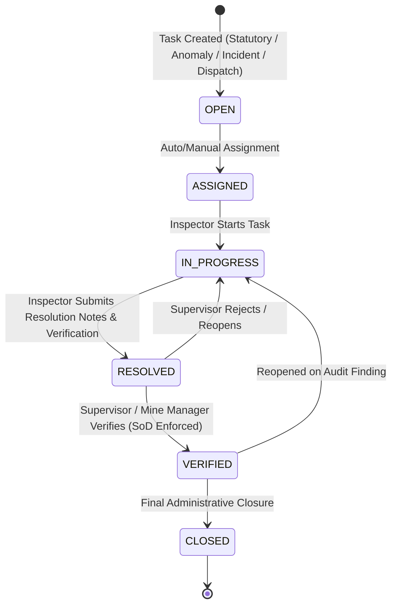

# TRINETRA Mobile Architecture: Field Tasks, Work Queue & Shift Operations (MOBILE-06)

## 1. Overview & Purpose
The **MOBILE-06** subsystem introduces the unified mobile field work queue and operational shift layer for TRINETRA. It establishes a closed-loop field execution architecture connecting:
$$\text{HOME} \to \text{MY WORK} \to \text{PRIORITIZE} \to \text{MAP} \to \text{EXECUTE} \to \text{RESPOND} \to \text{EVIDENCE} \to \text{SUBMIT} \to \text{SYNC} \to \text{VERIFICATION}$$

This phase reuses authoritative backend models (`GovernanceTask`, `FieldInspection`, `Shift`, `AttendanceRecord`, `Incident`, `FieldEvidence`, `AuditEvent`, `FieldSyncLog`) without creating redundant schemas.

---

## 2. Core Architecture & Workflow Lifecycle

### 2.1 State Machine Rules
1. **`OPEN` / `ASSIGNED` $\to$ `IN_PROGRESS`**: Field worker or inspector acknowledges assignment and initiates fieldwork.
2. **`IN_PROGRESS` $\to$ `RESOLVED`**: Worker completes physical checks or remediation. Mandatory `resolution_notes` and evidence checklist confirmation required. Empty submissions are rejected ($422$).
3. **`RESOLVED` $\to$ `VERIFIED`**: Supervisory role (`MINE_MANAGER`, `MINE_SAFETY_OFFICER`, `REGULATOR`, `SYSTEM_ADMIN`) verifies the field execution.
4. **Separation of Duties (SoD)**: The assigned inspector *cannot self-verify* resolution of their own task ($403$/$422$ violation).
5. **`VERIFIED` $\to$ `CLOSED`**: Permanent audit record finalization.

---

## 3. Unified Work Queue & Endpoints

| Endpoint | Method | Role Scoping | Description |
|---|---|---|---|
| `/api/v1/mobile/work-queue` | `GET` | Mine-isolated / Role-aware | Returns unified work queue tasks, real-time counter metrics (`total`, `critical`, `high`, `due_today`, `overdue`, `assigned`, `in_progress`, `completed`, `verification_pending`), and shift context. |
| `/api/v1/mobile/tasks/{id}/status` | `PATCH` | Inspector / Supervisor | State transition endpoint enforcing valid state jumps, mandatory resolution notes, SoD, and SHA-256 audit ledger logging. |
| `/api/v1/mobile/shift-context` | `GET` | Mine-isolated | Returns operational shift window (06:00–14:00, 14:00–22:00, 22:00–06:00), active status, and muster attendance record. |

---

## 4. UI/UX Structure & Deep Linking

1. **Home Screen (`MobileHomeScreen.tsx`)**:
   - **"MY WORK" Card**: High-impact counters for Critical, High, Due Today, Overdue, and Completed tasks.
   - **"CURRENT SHIFT & ATTENDANCE" Card**: Displays operational shift name, shift window, muster attendance verification status (`RFID_TAGGED`, `SYSTEM_VERIFIED`), and check-in timestamp.
2. **Work Queue Screen (`MobileTasksScreen.tsx`)**:
   - **Tab Navigation**: `ALL`, `ASSIGNED`, `IN_PROGRESS`, `DUE_TODAY`, `OVERDUE`, `VERIFICATION`, `COMPLETED` with badge counts.
   - **Dynamic Search & Filtering**: Multi-field search across title, description, domain, and zone with deterministic sorting (Priority $\to$ Due Date $\to$ Creation Time).
   - **Task Cards**: Real-time SLA countdown badges, priority indicators, location coordinates, and action triggers.
   - **Task Details & Resolution Modal**: Rich interactive drawer supporting step-by-step resolution notes, statutory evidence confirmation, and role-based action buttons.
   - **Deep Linking Protocol**: Direct routing to Map (`[ MAP ]`), Inspection Execution (`[ INSPECT ]`), Incident Response (`[ INCIDENT ]`), and Copilot (`[ COPILOT ]`).

---

## 5. Security, Mine Isolation & Auditability

- **Multi-Tenant Mine Scoping**: All task queries enforce strict `mine_id` validation via `check_mine_access`.
- **Immutable Ledger Logging**: Every task state transition automatically writes a cryptographic `AuditEvent` linking the actor, previous state, new state, notes, and timestamp.
- **Strict Git Lock**: All code changes strictly maintained locally in compliance with repository governance instructions.
